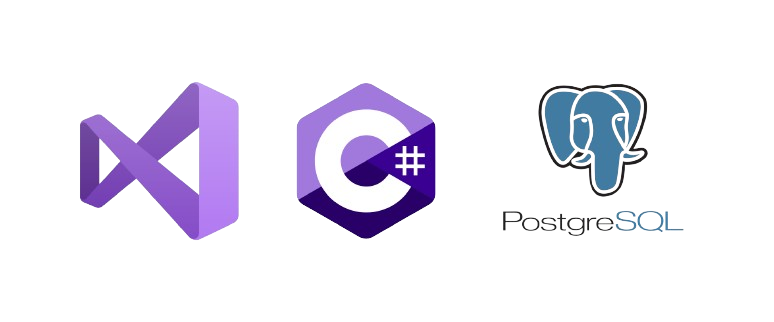
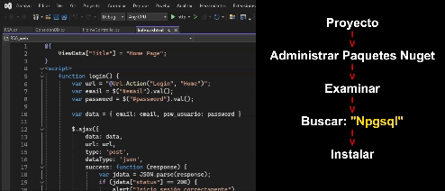

  

  <h1 align="center">RSA</h1>
  

    "Implementé seguridad 🔐 en un login MVC con C#, usando RSA para encriptar contraseñas almacenadas en PostgreSQL. 💻🔒 #CSharp #RSA #PostgreSQL"
  

   <h2 align="center">Herramientas Principales Utilizadas</h2>
   

  
   

  <h4 align="center">VisualStudio:</h4>
   

    Visual Studio se utiliza en este proyecto como entorno de desarrollo integrado (IDE) para C#. Ofrece herramientas avanzadas, depuración, 
     integración con Git y un conjunto de características que agilizan el desarrollo de aplicaciones web con ASP.NET Core. La interfaz intuitiva 
     y las funcionalidades de productividad hacen de Visual Studio una opción poderosa para construir y mantener aplicaciones en el ecosistema .NET.
   

   <h4 align="center">C# en el código:</h4>
   

     C# se seleccionó para este proyecto web MVC debido a su integración óptima con ASP.NET y su capacidad para desarrollar aplicaciones robustas. 
     Con una sintaxis clara y orientada a objetos, C# facilita la creación de software estructurado. Su estrecha relación con Visual Studio y la 
     compatibilidad con PostgreSQL contribuyen a una solución completa y eficiente.
   

   <h4 align="center">PostgreSQL:</h4>
   

     PostgreSQL se eligió como base de datos para este proyecto por su robustez, capacidad para manejar grandes conjuntos de datos y su compatibilidad 
     con el modelo de datos relacional. Además, su licencia de código abierto y la sólida comunidad de usuarios ofrecen una solución confiable y escalable 
     para almacenar y gestionar la información del sistema.
   

  <h2 align="center">⚠️Extensiones de PostgreSQL necesarias de instalar⚠️</h2>
   

     Npgsql es un proveedor de datos .NET para PostgreSQL, que permite a las aplicaciones .NET comunicarse con bases de datos PostgreSQL. Actúa como un puente 
     entre la aplicación escrita en C# (u otro lenguaje .NET) y el sistema de gestión de bases de datos PostgreSQL. 
   

     
   
